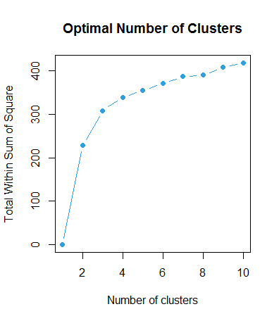
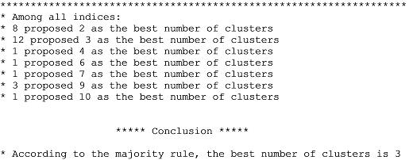
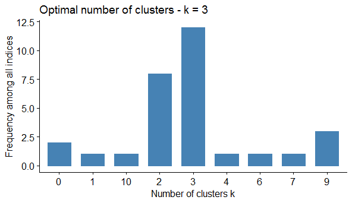
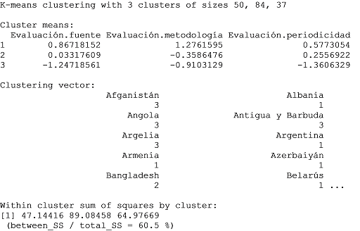
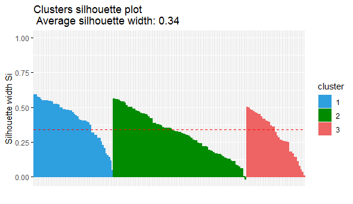
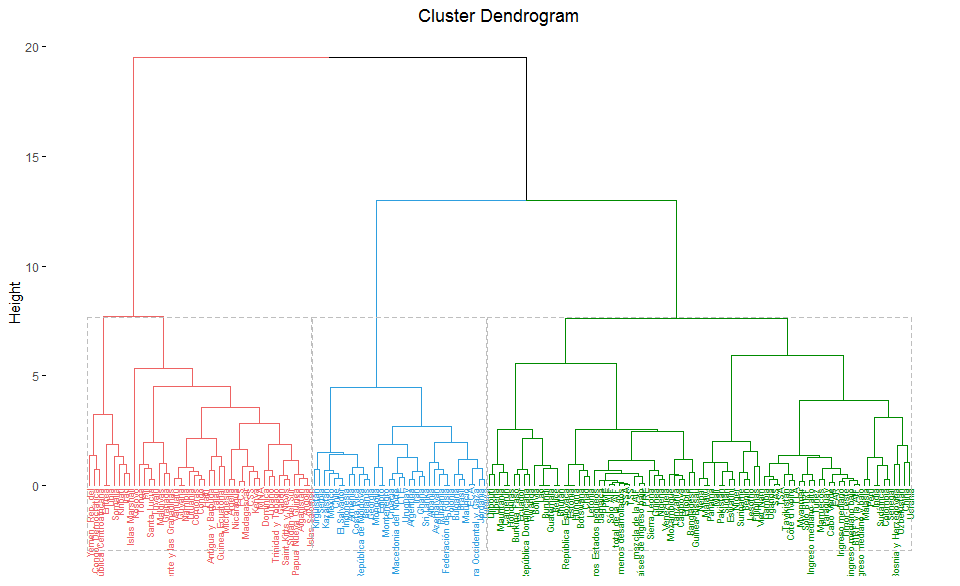
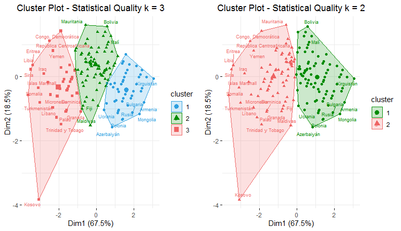
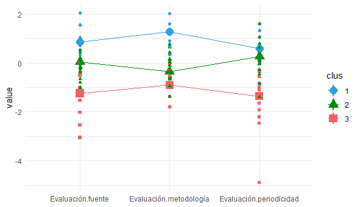
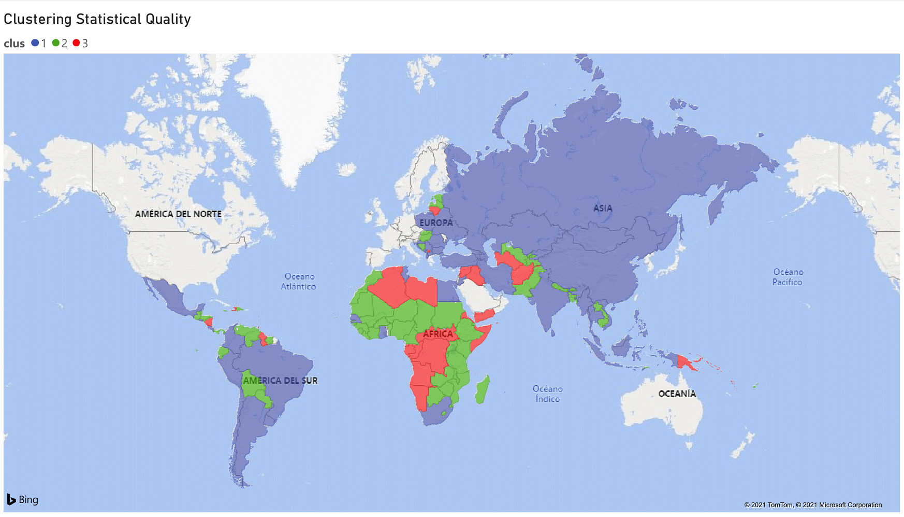

### Clustering-K-means
#### 1.	Introducción
Según datos del Banco Mundial la capacidad del sistema de estadística de un país se evalúa a través del diagnóstico de 3 áreas: metodología; fuentes de datos; y periodicidad y puntualidad. El puntaje para cada variable se calcula con una escala de 0 a 100, usando la información disponible públicamente o la aportada por cada país. El conjunto de datos usado a continuación corresponde al año 2019 y contiene 444 observaciones contenidos en las siguientes variables:

	“Evaluación de los Datos Fuente de la Capacidad Estadística (escala 0 – 100)
	“Evaluación Metodológica de la Capacidad Estadística (escala 0 – 100)
	“Evaluación de la periodicidad y puntualidad de la Capacidad Estadística (escala 0 – 100)	

El objetivo es realizar un análisis con un marcado carácter exploratorio, es decir, obtener clasificaciones (clusterings) que permitan examinar el nivel de la capacidad estadística de algunas naciones con niveles de desarrollo alto y de una mayoría que se encuentra en vías de desarrollo.  

#### 2.	Estimando el número óptimo de clusters
Se utiliza el método de la suma interna de cuadrados. Visualmente se puede inferir que el patrón se estabiliza a partir de 3, por tanto, el número apropiado de grupos (K) se encuentra entre 2 y 3. Para comprobar lo observado en la gráfica se ejecuta NbClust que ofrece el número de clusters indicado según todos los métodos disponibles.

<p align="center">
  
</p>




<p align="center">
  
</p>

Se comprueba el rango y se elige mayoritariamente K = 3 por lo que se ejecutan las K-medias.

#### 3.	Asignación de clusters con k-means
Al asignar los grupos según k = 3 se determina que los clusters están definidos según 3 niveles de calidad de la información siendo el primer grupo el que cuenta con mayor calidad estadística y así sucesivamente.


 
Al imprimir el resultado, se observa el ratio de la suma de cuadrados entre-clusters y la suma de cuadrados totales, este ratio que indica el porcentaje de varianza explicada por el modelo respecto al total de varianza observada es de 60.5 % indicando que los conglomerados son compactos.  Al realizar la misma prueba con k = 2 el ratio es de 44,9%.

#### 4.	Validación de clustering 
Con el fin de evaluar la bondad del agrupamiento de k = 3 se usa el coeficiente de silueta (ancho de silueta). La gráfica de silueta a continuación da evidencia de que el agrupamiento es relativamente bueno al no existir un ancho de silueta negativo y con valores mayores que 0.3. 

<p align="center">
  
</p>

```
  cluster size ave.sil.width
1       1   50          0.42
2       2   84          0.31
3       3   37          0.31
```

#### 5.	Análisis de clusters
Los 3 conglomerados están definidos como: de alta calidad estadística (azul), mediana calidad (verde) y menor calidad (rojo). Siendo significativamente mayor la cantidad de integrantes del grupo intermedio. La mayoría de países contemplados en el análisis se ubican en este rango.



El gráfico de conglomerados muestra que el cluster que representa los países con menor calidad estadística se encuentra bien agrupado, sin embargo, los grupos correspondientes a niveles medio y alto están muy cerca. La mayor similitud entre estos grupos corresponde a la evaluación de la periodicidad y la puntualidad de la información que en ambos grupos se encuentra en una posición similar, lo que afecta la heterogeneidad del agrupamiento k = 3. Mientras que el resto de observaciones según cada variable se encuentran distribuidas de forma dispar.

<p align="center">
  
</p>

Un caso particular es del Kosovo país que cuenta con un índice peculiarmente bajo en cuanto a periodicidad y puntualidad (20 puntos) con respecto a las observaciones de las demás naciones que se encuentran sobre 50 puntos en la escala.

<p align="center">
  
</p>

Los países que se encuentran en el cluster referente a menor calidad estadística corresponden a países con economías incipientes o en situación de conflicto beligerante, tal es el caso de la región de África Central o naciones como Siria o Libia. Los métodos estadísticos dependen del apoyo institucional y de sistemas organizados de recolección, transformación, cuantificación y difusión de la información, inversión que se hace dificultosa ante la presencia de situaciones de inestabilidad interna.
En tanto, en América Latina y Asía la mayoría de las naciones tienen un nivel alto de calidad estadística (dentro de la totalidad de los países utilizados para el estudio). 




